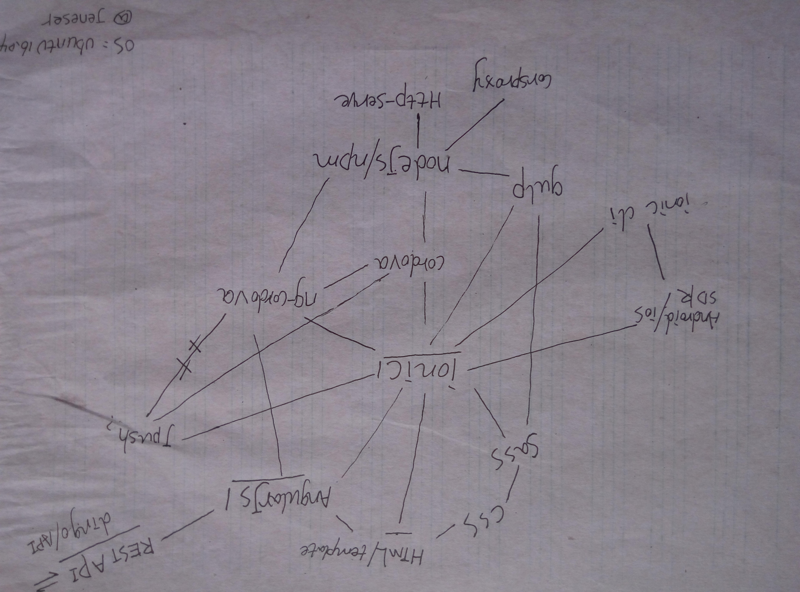

# HPU二狗 - 最适合河南理工大学童鞋使用的手机APP。

[](http://jenes.site)

## 截图


## 技术栈



## 加入我们

如果你会写一些`JS`, `HTML`, `CSS`, 了解一些前端框架，并有迈向移动端的想法，加入我们吧！

## 如何开始

``` bash
# 克隆仓库
git clone https://github.com/jeneser/hpuHelper.git

# 运行
ionic serve

# OK good job！
```

## License

[MIT license](http://opensource.org/licenses/MIT)
